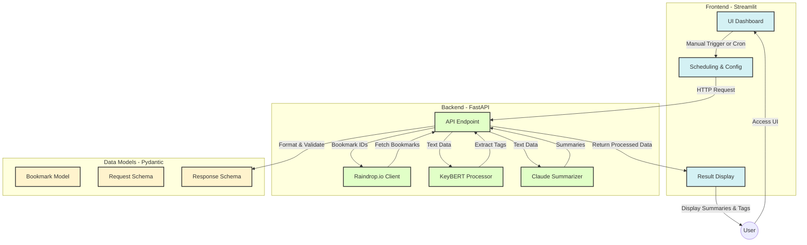

### **Product Requirements Document (PRD)**

---

#### **1. Document Overview**

- **Document Title**: raindrop_processing_automation  
- **Version**: 0.1.0  
- **Date**: 2025-01-01  
- **Authors**: dorschre  

---

#### **2. Executive Summary**

- **Objective**  
  The goal of this project is to create an automated system for processing raindrop.io bookmarks.  

- **Scope**  
  The project will be a web application, triggered either manually or automatically (e.g., via cron jobs). It will interface with the raindrop.io API, extract tags and summaries from bookmarks, and optionally update bookmarks with the new information. The application will be built in Python and make use of:
  - **Streamlit** for the user interface  
  - **raindrop-io-py** for the Raindrop.io API calls  
  - **KeyBERT** for tag extraction  
  - **Anthropic’s Claude API** for summary generation  
  - **Pydantic** for data modeling  
  - **FastAPI** for the backend  

- **Target Audience**  
  Anyone who wants to automate the processing of their Raindrop.io bookmarks—particularly individuals who frequently bookmark resources and need a concise, summarized view or robust tagging system.

- **Expected Outcomes**  
  - A user-friendly interface (UI) for managing Raindrop.io bookmark processing  
  - A backend that retrieves Raindrop.io bookmarks, extracts tags, and generates summaries  
  - Automatic or manual bookmarking processing, supported by cron-job scheduling  
  - Updated bookmarks on Raindrop.io with newly extracted tags and summaries  

---

#### **3. Background and Context**

- **Literature/Related Work**  
  - **Raindrop.io API**: [https://developer.raindrop.io/](https://developer.raindrop.io/)  
  - **raindrop-io-py**: [https://github.com/PBorocz/raindrop-io-py](https://github.com/PBorocz/raindrop-io-py)  

- **Related Work**  
  - Use of KeyBERT for keyword or tag extraction in text-based applications  
  - Use of large language model APIs (e.g., Anthropic’s Claude) for summarization and natural language processing  

- **Example Frontend (Reference)**  
  - While the primary focus is on Raindrop.io integration, you may refer to existing frontend documentation for best practices: [Frontend Documentation](docs/product-requirement-document-assets/frontend/)

---

#### **4. Functional Requirements**

- **Core Features**  
  1. **Manual Bookmark Processing**  
     - Users can manually trigger the processing of Raindrop.io bookmarks.  
  2. **Automated Bookmark Processing**  
     - Users can set up a cron job (or similar scheduling mechanism) to automatically trigger the processing of Raindrop.io bookmarks.  
  3. **Tag Extraction**  
     - KeyBERT automatically extracts relevant tags from bookmarks.  
  4. **Summary Generation**  
     - Anthropic's Claude API generates summaries of bookmark content.  
  5. **Bookmark Updates**  
     - The system can optionally write extracted tags and summaries back to Raindrop.io bookmarks.

- **User Stories**  
  1. As a user, I want to **manually trigger** the processing of Raindrop.io bookmarks so that I can pick and choose when I run updates.  
  2. As a user, I want to **set up a cron job** to automatically process bookmarks without ongoing manual intervention.  
  3. As a user, I want to **extract tags and summaries** from my bookmarks so that I can more easily categorize and reference them later.  
  4. As a user, I want to **update the Raindrop.io bookmarks** with new metadata so that I have a cleaner and more organized bookmarking system.  

- **Key Algorithms or Components**  
  - **KeyBERT** for tag extraction  
  - **Anthropic’s Claude API** for summarization  
  - **FastAPI** for the backend services  
  - **Pydantic** for data modeling and validation  

---

#### **5. Non-Functional Requirements**

- **Performance**  
  - API response times should generally remain under 500ms for processing up to 20 bookmarks at once (dependent on external API latency).  
  - The system should handle synchronous or batched requests without excessive delays.  

- **Scalability**  
  - The solution should accommodate growing numbers of bookmarks, with the possibility of scaling the backend horizontally.  
  - Cron-based scheduling or queue-based processing should handle peaks (e.g., processing hundreds of bookmarks at once).  

- **Reliability and Availability**  
  - Aim for **99.9%** uptime.  
  - Implement clear logging and error handling in case of failures from the Raindrop.io API, KeyBERT, or Anthropic’s Claude API.  

- **Usability**  
  - Simple Streamlit-based UI with clear steps: Connect to Raindrop.io, configure processing, and review results.  
  - Real-time or near-real-time indicators for status (e.g., “Processing Bookmarks…”).  

- **Security and Privacy**  
  - **OAuth** or **secure token-based authentication** for accessing the Raindrop.io API.  
  - Validate bookmark content to ensure data integrity and guard against injection attacks.  
  - Dispose of any temporary data responsibly, especially partial text content used for summarization.  

---

#### **6. Technical Architecture**

- **System Components**  
  1. **Frontend (Streamlit)**  
     - Provides a simple UI for configuring Raindrop.io processing.  
     - Displays results of tag extraction and summaries, and shows a log of bookmarks that have been recently updated. The log indicates whether the tag, summary, or both have been updated.  
     - Allows manual triggers and configuration for cron-based automation.  
  2. **Backend (FastAPI)**  
     - Handles Raindrop.io API interactions (e.g., retrieving bookmarks, updating tags/summaries).  
     - Integrates with KeyBERT for tag extraction.  
     - Integrates with Anthropic’s Claude API for text summarization.  
     - Routes requests from the Streamlit frontend and returns processed data.  
  3. **Data Models (Pydantic)**  
     - Define request/response schemas for bookmark processing.  
     - Validate bookmark content and ensure that summary/tag data meets required formats.  

- **System Flow**  
  1. **User Trigger** (Manual or via Cron) → **Streamlit UI**  
  2. **Request** → **FastAPI Backend**  
  3. **Bookmark Retrieval** → **Raindrop.io**  
  4. **Tag Extraction** → **KeyBERT**  
  5. **Summary Generation** → **Anthropic’s Claude API**  
  6. **Response** → **Streamlit UI** (display new tags and summary)  
  7. **Optional Bookmark Update** → **Raindrop.io** (via FastAPI)  

- **API Endpoints (Example)**  
  ```python
  from fastapi import FastAPI
  from pydantic import BaseModel, Field
  from typing import List, Optional
  from datetime import datetime

  app = FastAPI()

  class Bookmark(BaseModel):
      id: str
      link: str
      tags: List[str] = Field(default_factory=list)
      summary: Optional[str] = None
      created_at: datetime
      updated_at: Optional[datetime] = None

  class BookmarkProcessingRequest(BaseModel):
      bookmark_ids: List[str]

  class BookmarkProcessingResponse(BaseModel):
      processed_bookmarks: List[Bookmark]
      failed_bookmarks: List[str] = Field(default_factory=list)
      total_processing_time_ms: float

  class ProcessingHistoryResponse(BaseModel):
      history: List[Bookmark] = Field(default_factory=list)

  @app.post("/process-bookmarks/", response_model=BookmarkProcessingResponse)
  async def process_bookmarks(request: BookmarkProcessingRequest):
      """
      Endpoint to process given Raindrop.io bookmark IDs:
      1. Retrieve bookmarks from Raindrop.io
      2. Generate tags using KeyBERT
      3. Generate summary using Anthropic’s Claude
      4. Return processed data (and optionally update on Raindrop.io)
      """
      pass

  @app.post("/update-bookmark-processing/", response_model=BookmarkProcessingResponse)
  async def update_bookmark_processing(request: BookmarkProcessingRequest):
      """
      Endpoint to update bookmark processing results:
      1. Modify tags or summaries
      2. Synchronize updates with Raindrop.io
      3. Return updated bookmark information
      """
      pass

  @app.get("/processing-history/", response_model=ProcessingHistoryResponse)
  async def get_processing_history():
      """
      Endpoint to retrieve the history of processed bookmarks.
      Returns a log of bookmarks with details of the latest updates.
      """
      pass
  ```


- **Data Flow**  
  1. **Bookmark Retrieval** → Validation → Tag Extraction (KeyBERT) → Summarization (Claude) → **Processed Data**  
  2. **Batch Processing** → Option to run multiple bookmarks in parallel or in sequence  
  3. **Update** → Send updated tags and summary back to Raindrop.io  

- **Frontend Example**  
  - An example of the frontend can be found [here](docs/examples/frontend/example.py)

- **Infrastructure**  
  - **Docker** containers for frontend (Streamlit) and backend (FastAPI).  
  - Possible use of a **task scheduler** (cron on the same server or a separate scheduling service).  
  - **Load balancer** for scaling backend if needed.  

- **Monitoring and Logging**  
  - Collect application metrics (e.g., number of bookmarks processed, average processing time).  
  - Error tracking for external API failures (Raindrop.io, Anthropic).  
  - Logs for user actions (when and how many bookmarks were processed).  

---

#### **7. Architecture Diagram**



**Diagram Explanation**:  
1. **Frontend Layer (Streamlit)**  
   - Configuration for manual or automated triggers  
   - Displays result (tags and summaries)  
   - Shows a log of recently updated bookmarks, indicating changes to tags, summaries, or both.  
2. **Backend Layer (FastAPI)**  
   - Integrates with Raindrop.io, KeyBERT, and Anthropic’s Claude API  
   - Orchestrates bookmark retrieval, processing, and updating  
3. **Data Models (Pydantic)**  
   - Ensures data integrity and clarity between processes  

---

#### **8. Testing and Validation**

- **Evaluation Metrics**  
  - **Accuracy of Tag Extraction** (precision and recall of KeyBERT tags)  
  - **Quality of Summaries** (subjective measure or user feedback)  
  - **Speed of Processing** (time per bookmark)  

- **Testing Strategy**  
  1. **Unit Tests**:  
     - Validate KeyBERT integration with mock data.  
     - Ensure correct handling of Raindrop.io API responses.  
  2. **Integration Tests**:  
     - Test end-to-end processing from user trigger to final bookmark update.  
  3. **User Acceptance Tests**:  
     - Let a test group manually trigger processing to validate ease of use and correctness of tags/summaries.  

- **Data Sets**  
  - Use sample bookmarks from Raindrop.io or a test collection to benchmark performance and accuracy.  

---

#### **9. Deployment and Demonstration**

- **Deployment Environment**  
  - The application will be containerized using Docker (one container for the FastAPI backend, one for the Streamlit frontend).  
  - Cron-based scheduling can reside on the same host or within a separate container that triggers the API endpoints.  

- **User Documentation**  
  - **Streamlit Interface**: Explains how to connect Raindrop.io, set up processing configurations, and view results.  
  - **Swagger UI**: Provides interactive API documentation and testing.  
  - **Configuration Manuals**: Details about setting up a cron job or scheduling mechanism.  

---

#### **10. Future Work**

- **Planned Extensions**  
  1. **Additional NLP Models**: Experiment with other summarization or tagging approaches (e.g., open-source large language models).  
  2. **Machine Learning Pipeline**: Incorporate user feedback loops on tag accuracy.  
  3. **Extended Metadata**: Integrate more advanced metadata extraction (e.g., entity recognition, sentiment analysis).  
  4. **Multi-Platform Support**: Extend the system to handle bookmarks from other services or different content sources.  

---

**Key Takeaways**  
1. This PRD outlines the **raindrop_processing_automation** system, detailing its core functionality of extracting tags and summaries from Raindrop.io bookmarks.  
2. The solution leverages **KeyBERT** for tag extraction and **Anthropic’s Claude API** for summarization, orchestrated through a **FastAPI** backend and a **Streamlit** frontend.  
3. **Scalability**, **usability**, and **reliability** are central design considerations, enabling both manual and automated bookmark processing.  
4. Future enhancements can expand the system’s capabilities with more sophisticated NLP techniques and multi-platform support.

